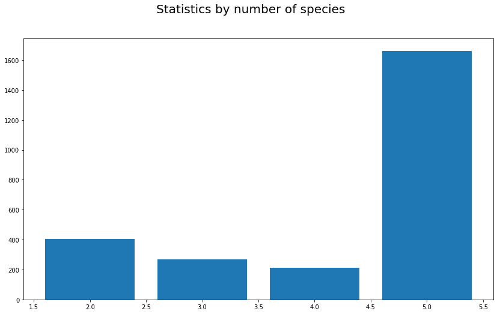
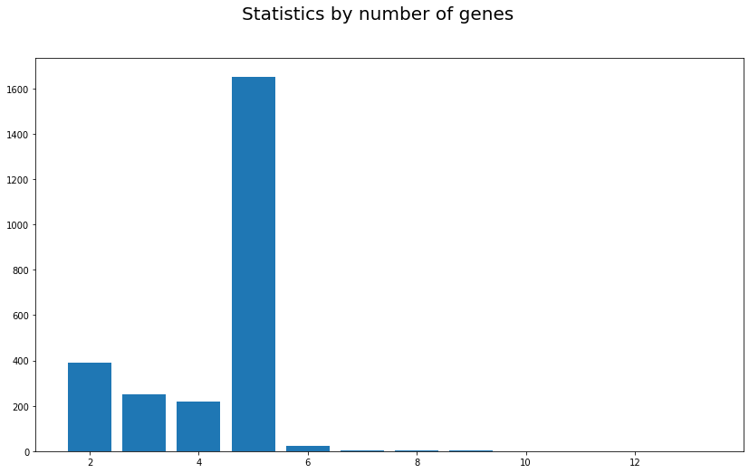
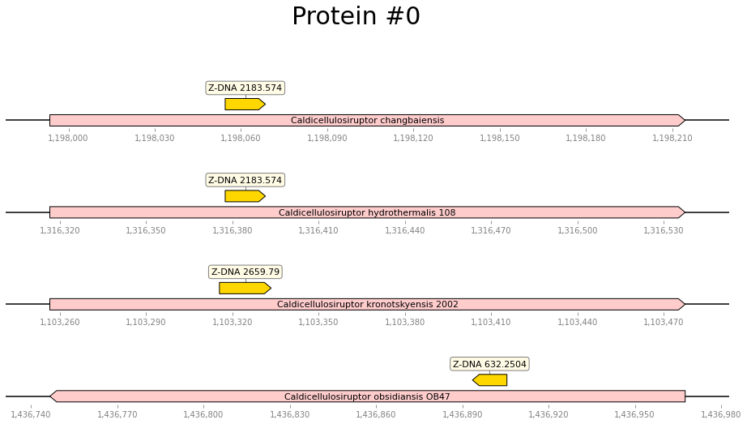
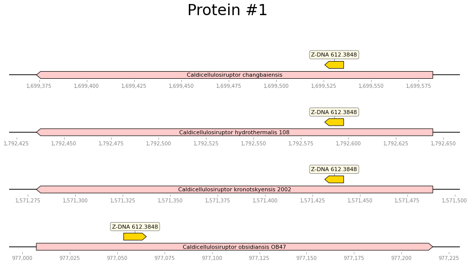
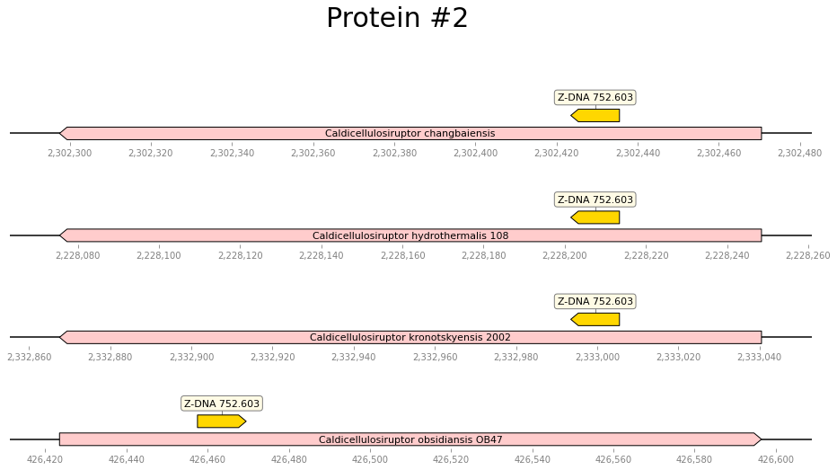
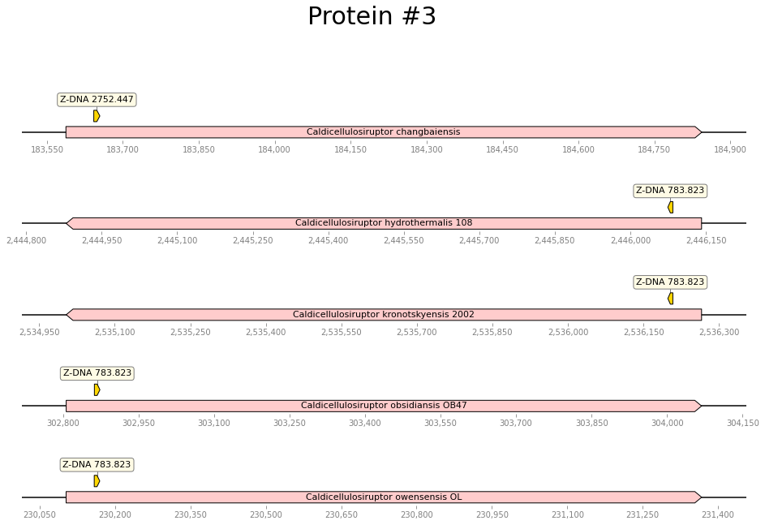
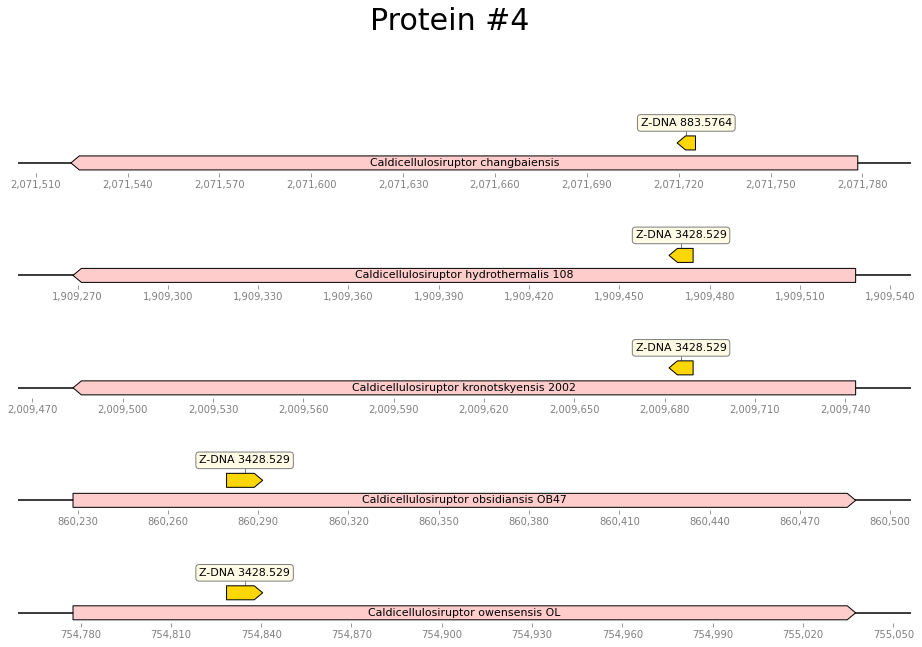

# hse22_project

## Анализ аннотированных генов

||Caldicellulosiruptor changbaiensis|Caldicellulosiruptor hydrothermalis 108|Caldicellulosiruptor kronotskyensis 2002|Caldicellulosiruptor obsidiansis OB47|Caldicellulosiruptor owensensis OL|
|---|---|---|---|---|---|
|Total Length|2905633|2770676|2843785|2532343|2428903|
|Number of sequences|1|1|1|1|1|
|Number of annotated genes|2833|2679|2623|2404|2333|
|% of annotated genes in genome|89\.103854478525|90\.89363029094704|90\.22257308481478|89\.7423848191181|90\.9399840174762|

||Caldicellulosiruptor changbaiensis|Caldicellulosiruptor hydrothermalis 108|Caldicellulosiruptor kronotskyensis 2002|Caldicellulosiruptor obsidiansis OB47|Caldicellulosiruptor owensensis OL|
|---|---|---|---|---|---|
|Number of Z-DNA segments|2905633|2770676|2843785|2532343|2428903|
|Number of Z-DNA segments with ZH-score \> 500|764|1039|893|754|711|
|Overall length of Z-DNA segments|7538|10168|8738|7410|6932|

## Информация по полученным гомологичным кластерам

Всего кластеров было 2545

Распределение по количеству геномов в кластере:

Распределение по количеству генов в кластере:

В общем-то, распределения отличаются незначительно

## Таблицы с информацией по выбранным кластерам

### Общая информация

||0\_protein|1\_protein|2\_protein|3\_protein|4\_protein|
|---|---|---|---|---|---|
|Number of genes in cluster|5|5|5|5|5|
|Number of genes in cluster with Z-DNA|4|4|4|5|5|
|Function| ferrous iron transport protein A|50S ribosomal protein L31|4Fe-4S binding protein|domain-containing protein|ribosomal L7Ae/L30e/S12e/Gadd45 family protein|

### Z-DNA score

||Caldicellulosiruptor changbaiensis|Caldicellulosiruptor hydrothermalis 108|Caldicellulosiruptor kronotskyensis 2002|Caldicellulosiruptor obsidiansis OB47|Caldicellulosiruptor owensensis OL|
|---|---|---|---|---|---|
|0\_protein|NaN|2183\.574|2183\.574|2659\.79|632\.2504|
|1\_protein|NaN|612\.3848|612\.3848|612\.3848|612\.3848|
|2\_protein|752\.603|752\.603|752\.603|NaN|752\.603|
|3\_protein|2752\.447|783\.823|783\.823|783\.823|783\.823|
|4\_protein|883\.5764|3428\.529|3428\.529|3428\.529|3428\.529|

### Расположение на геноме (относительное)

||Caldicellulosiruptor changbaiensis|Caldicellulosiruptor hydrothermalis 108|Caldicellulosiruptor kronotskyensis 2002|Caldicellulosiruptor obsidiansis OB47|Caldicellulosiruptor owensensis OL|
|---|---|---|---|---|---|
|0\_protein|\[0.196,0.242]|\[0.276,0.339]|\[0.276,0.339]|\[0.267,0.348]|\[0.281,0.335]|
|1\_protein|\[0.281,0.335]|\[0.225,0.273]|\[0.225,0.273]|\[0.225,0.273]|\[0.220,0.278]|
|2\_protein|\[0.202,0.272]|\[0.202,0.272]|\[0.202,0.272]|\[0.202,0.272]|\[0.197,0.266]|
|3\_protein|\[0.044,0.053]|\[0.045,0.053]|\[0.045,0.053]|\[0.044,0.053]|\[0.044,0.053]|
|4\_protein|\[0.206,0.230]|\[0.208,0.238]|\[0.208,0.238]|\[0.196,0.242]|\[0.196,0.242]|

## Выравнивание

Информация о выравнивании i-ого белка лежит в  alignment_data/protein_{i}.clustal_num (в markdown травмируется вёрстка)

## Визуализация

Визуализация Z_DNA на различных белках:

